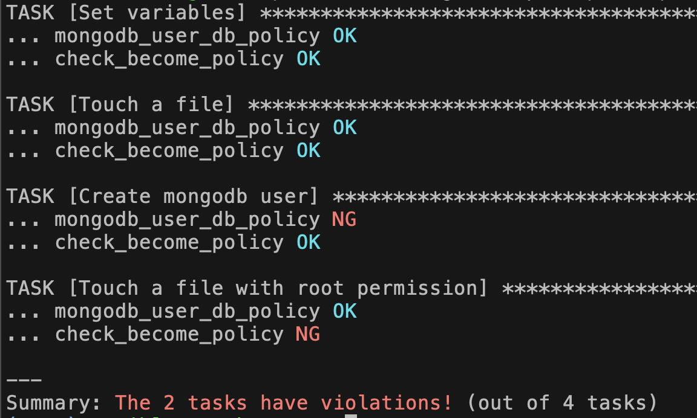

# ansible-gatekeeper

## Getting started

### 1. Install `opa` command

refer to OPA [document](https://github.com/open-policy-agent/opa#want-to-download-opa)

### 2. git clone

clone this repository

### 3. Install `ansbile-gatekeeper` command

```bash
$ cd ansible-gatekeeper
$ pip install -e .
```

### 4. iInstall `gatekeeper.rego` modules

```bash
$ ansible-galaxy collection install collections/gatekeeper.rego --force

Starting galaxy collection install process
Process install dependency map
Starting collection install process
Installing 'gatekeeper.rego:0.0.1' to '/Users/user/.ansible/collections/ansible_collections/gatekeeper/rego'
Created collection for gatekeeper.rego:0.0.1 at /Users/user/.ansible/collections/ansible_collections/gatekeeper/rego
gatekeeper.rego:0.0.1 was installed successfully
```

### 5. Configure policies

A configuration for ansible-gatekeeper is something like the following.

```ini
[policy]
default disabled
policies.community.*      tag=security    enabled
policies.org.compliance   tag=compliance  enabled

[source]
# policies.community.mongodb = policies.community_mongodb:0.0.1     # collection policy
policies.community.mongodb = examples/policies-community_mongodb-0.0.1.tar.gz   # collection policy
policies.org.compliance    = examples/org_wide_policies/compliance    # org-wide compliance policy
```

`policy` field is a configuration like iptable to enable/disable installed policies. Users can use tag for configuring this in detail.

`source` field is a list of module packages and their source like ansible-galaxy or local directory. ansible-gatekeeper installs policies based on this configuration.

The example above is configured to enable the follwoing 2 policies.

- `mongodb_user_db_policy`: check if a database name which is used in the task is allowed or not, for tasks using `community.mongodb.mongodb_user`.
- `check_become_policy`: check if `become: true` is used or not for all tasks

You can use [the example config file](examples/ansible-gatekeeper.cfg) for the next step.

### 6. Running policy evaluation on a playbook

[The example playbook](examples/project/playbook.yml) has some tasks that violate the 2 policies above.

ansible-gatekeeper can report these violations like the following.

```bash
$ ansible-gatekeeper -p examples/project/playbook.yml -c examples/ansible-gatekeeper.cfg
```




[The third task](examples/project/playbook.yml#L15) `Create mongodb user` is using a database `not-allowed-db` by a variable, and the variable is successfully resolved and this value is reported as a policy violation.

[The fourth task](examples/project/playbook.yml#L23) `Touch a file with root permission` is creating a file with a root permission by using `become: true`, and this is detected by the policy `check_become_policy`.


```
NOTE: Only first time you run the command above, ansible-gatekeeper installs policy files based on the configuration.
      If you changed your policy files, please reinstall them by removing the installed policies manually. They are installed `/tmp/ansible-gatekeeper/installed_policies` by default.
```