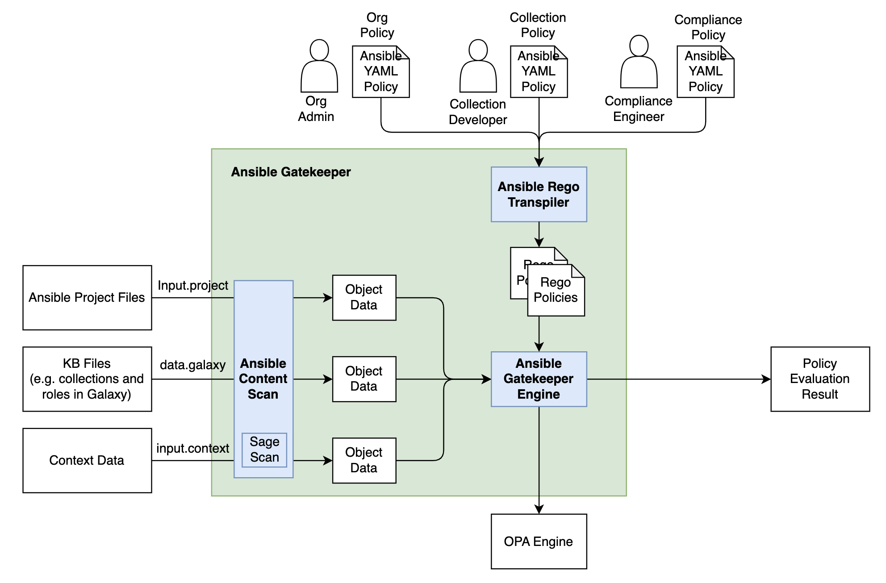
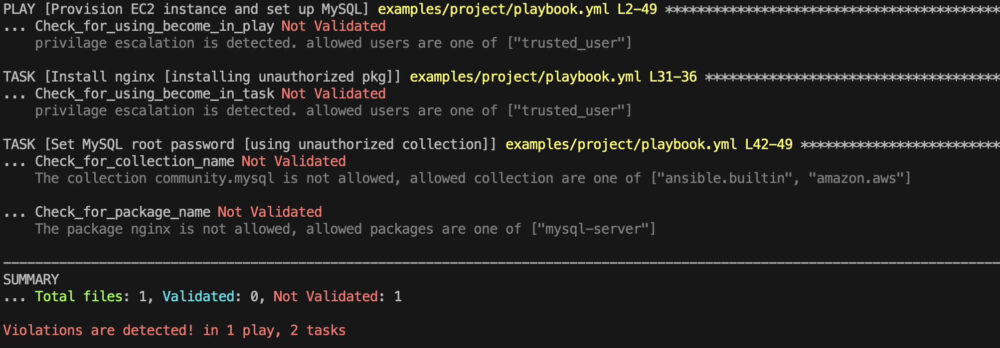
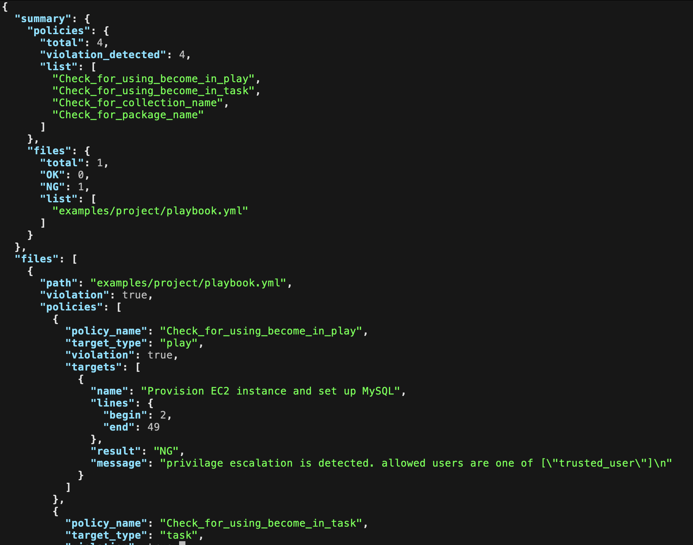

# Ansible Gatekeeper

Ansible Gatekeeper is a prototype implementation which allows us to define and set constraints to the Ansible project in OPA Rego language. The key features of Ansible Gatekeeper are
- Ansible project is auto scanned as objects and accessible from OPA policy (using ARI project scanning internally).
- Ansible knowledge base acquired from external sources such as Galaxy can be used from OPA policy.
- Multiple policy resolution from the scanned Ansible content.
- Policies can be packed as an ansible collection.
- Users can define policy in Ansible YAML format (playbook). It can be auto-transformed with `gatekeeper.rego` modules.



## Getting started

### 1. Install `opa` command

refer to OPA [document](https://github.com/open-policy-agent/opa#want-to-download-opa)

### 2. git clone

clone this repository

### 3. Install `ansbile-gatekeeper` command

```bash
$ cd ansible-gatekeeper
$ pip install -e .
```

<!--
### 4. Install `gatekeeper.rego` modules

```bash
$ ansible-galaxy collection install collections/gatekeeper.rego --force

Starting galaxy collection install process
Process install dependency map
Starting collection install process
Installing 'gatekeeper.rego:0.0.1' to '/Users/user/.ansible/collections/ansible_collections/gatekeeper/rego'
Created collection for gatekeeper.rego:0.0.1 at /Users/user/.ansible/collections/ansible_collections/gatekeeper/rego
gatekeeper.rego:0.0.1 was installed successfully
```
-->

### 4. Generate Rego policies from Policybook
As examples, the following policybooks can be found in the `examples/org_wide_policies` directory. 

-  `check_package_policy` [yml](./examples/org_wide_policies/compliance/policybooks/check_pkg.yml): Check if only authorized packages are installed.
- `check_collection_policy` [yml](./examples/org_wide_policies/compliance/policybooks/check_collection.yml): Check if only authorized collections are used
- `check_become_policy` [yml](./examples/org_wide_policies/compliance/policybooks/check_become.yml): check if `become: true` is used and check if only `trusted user` is used

In order to be evaluated by Ansible Gatekeeper, Policybooks should be converted to Rego policy.
Policybook can be automatically transpiled into `AST` and `Rego` policy with the commands below.

1. transform to AST
```
$ python ansible_gatekeeper/policybook/to_ast.py -d examples/org_wide_policies/compliance/policybooks -o examples/org_wide_policies/compliance/ast
```
2. transform to Rego
```
$ python ansible_gatekeeper/policybook/to_rego.py -d examples/org_wide_policies/compliance/ast -o examples/org_wide_policies/compliance/policies
```


Now, we have 3 policies written in Rego.
```
$ tree examples/org_wide_policies/compliance/policies                                          
examples/org_wide_policies/compliance/policies
├── Check_for_collection_name.rego
├── Check_for_package_name.rego
└── Check_for_using_become_in_task.rego
```

### 5. Configure policies

A configuration for ansible-gatekeeper is something like the following.

```ini
[policy]
default disabled
policies.org.compliance   tag=compliance  enabled

[source]
# policies.community.mongodb = policies.community_mongodb:0.0.1     # collection policy (ansible-galaxy)
# policies.community.mongodb = examples/policies-community_mongodb-0.0.1.tar.gz   # collection policy (local tarball)
policies.org.compliance    = examples/org_wide_policies/compliance    # org-wide compliance policy
```

`policy` field is a configuration like iptable to enable/disable installed policies. Users can use tag for configuring this in detail.

`source` field is a list of module packages and their source like ansible-galaxy or local directory. ansible-gatekeeper installs policies based on this configuration.

The example above is configured to enable the follwoing 3 `rego` policies, which we generated in **step 4**.
- [check_package_policy](./examples/org_wide_policies/compliance/policies/Check_for_package_name.rego)
- [check_collection_policy](./examples/org_wide_policies/compliance/policies/Check_for_collection_name.rego)
- [check_become_policy](./examples/org_wide_policies/compliance/policies/Check_for_using_become_in_task.rego)

<!-- - `mongodb_user_db_policy` ([yaml](./examples/collection_policies/policies.community_mongodb/policies/check_database_name.yml), [rego](./examples/collection_policies/policies.community_mongodb/policies/check_database_name_generated.rego)): check if a database name which is used in the task is allowed or not, for tasks using `community.mongodb.mongodb_user`.
- `check_become_policy` ([yaml](./examples/org_wide_policies/compliance/policies/check_become.yml), [rego](./examples/org_wide_policies/compliance/policies/check_become_generated.rego)): check if `become: true` is used or not for all tasks -->

You can use [the example config file](examples/ansible-gatekeeper.cfg) for the next step.

### 6. Running policy evaluation on a playbook

[The example playbook](examples/project/playbook.yml) has some tasks that violate the 3 policies above.

ansible-gatekeeper can report these violations like the following.

```bash
$ ansible-gatekeeper -p examples/project/playbook.yml -c examples/ansible-gatekeeper.cfg
```




From the result, you can see the details on violations.

- [The task "Install nginx"](examples/project/playbook.yml#L30) is installing a package `nginx` with a root permission by using `become: true`. Nginx is not listed in the allowed packages and this is detected by the `check_package_policy`. Also privilege escalation is detected by the `check_become_policy`.

- [The task "Set MySQL root password"](examples/project/playbook.yml#L41) is using a collection `community.mysql` which is not in the allowed list, and this is detected by the policy `check_collection_policy`.


Alternatively, you can output the evaluation result as a JSON file.

```bash
$ ansible-gatekeeper -p examples/project/playbook.yml -c examples/ansible-gatekeeper.cfg -o <OUTPUT_DIR>/agk-result.json
```

Then you would get the JSON file like the following.



The `summary` section in the JSON is a summary of the evaluation results such as the number of total policies, the number of policies with one or more violations, total files and OK/NG for each of them.

For example, you can get a summary about files by `jq` command like this.

```bash
$ cat agk-result.json | jq .summary.files
{
  "total": 1,
  "validated": 0,
  "not_validated": 1,
  "list": [
    "examples/project/playbook.yml"
  ]
}
```

The `files` section contains the details for each file evaluation result.

Each file result has results per policy, and a policy result contains multiple results for policy evaluation targets like tasks or plays.

For example, you can use this detailed data by the following commands.

```bash
# get overall result for a file
$ cat /tmp/agk-result.json | jq .files[0].violation
true

# get overall result for the second policy for the file
$ cat /tmp/agk-result.json | jq .files[0].policies[1].violation
true

# get an policy result for the second task in the file for the second policy
cat /tmp/agk-result.json | jq .files[0].policies[1].targets[1]
{
  "name": "Install nginx [installing unauthorized pkg]",
  "lines": {
    "begin": 31,
    "end": 36
  },
  "validated": false,
  "message": "privilage escalation is detected. allowed users are one of [\"trusted_user\"]\n"
}
```


```
NOTE: Only first time you run the command above, ansible-gatekeeper installs policy files based on the configuration.
      If you changed your policy files, please reinstall them by removing the installed policies manually. They are installed `/tmp/ansible-gatekeeper/installed_policies` by default.
```
