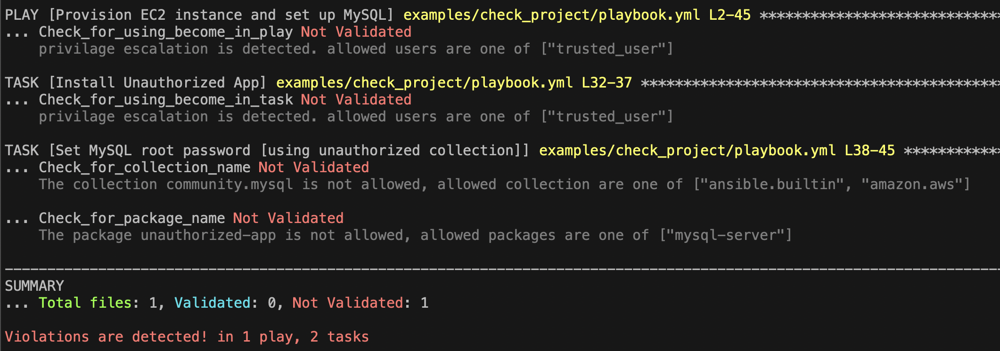
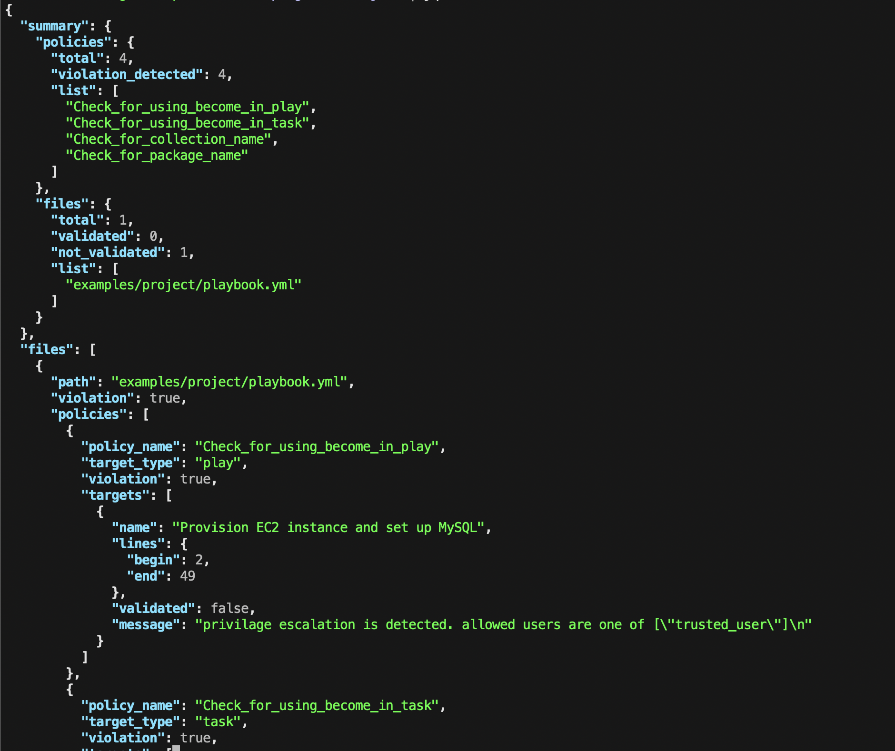

> **Note:** This repository is in prototype phase and under active development with subject to breaking changes.

# Ansible Policy

Ansible Policy is a prototype implementation which allows us to define and set constraints to the Ansible project in OPA Rego language. The key features of Ansible Policy are
- Ansible project is auto scanned as objects and accessible from OPA policy (using ARI project scanning internally).
- Ansible knowledge base acquired from external sources such as Galaxy can be used from OPA policy.
- Multiple policy resolution from the scanned Ansible content.
- Policies can be packed as an ansible collection.
- Users can define policy in YAML format (policybook). It can be auto-transformed with PolicyTranspiler.


## Getting started

### 1. Install `opa` command

refer to OPA [document](https://github.com/open-policy-agent/opa#want-to-download-opa)

### 2. git clone

clone this repository

### 3. Install `ansbile-policy` command

```bash
$ cd ansible-policy
$ pip install -e .
```

### 4. Prepare Policybook
As examples, the following policybooks can be found in the `examples/check_project/policies` directory.

-  `check_package_policy` [yml](./examples/check_project/policies/check_pkg.yml): Check if only authorized packages are installed.
- `check_collection_policy` [yml](./examples/check_project/policies/check_collection.yml): Check if only authorized collections are used
- `check_become_policy` [yml](./examples/check_project/policies/check_become.yml): check if `become: true` is used and check if only `trusted user` is used

ansible-policy transpile these policybooks into OPA policy automatically and evaluate the policies.

See this [doc](./ansible_policy/policybook/README.md) about Policybook specification.

### 5. Configure policies

A configuration for ansible-policy is something like the following.

```ini
[policy]
default disabled
policies.org.compliance   tag=compliance  enabled

[source]
policies.org.compliance    = examples/check_project    # org-wide compliance policy
```

`policy` field is a configuration like iptable to enable/disable installed policies. Users can use tag for configuring this in detail.

`source` field is a list of module packages and their source like ansible-galaxy or local directory. ansible-policy installs policies based on this configuration.

The example above is configured to enable the 3 policies in step 4.

You can use [the example config file](examples/ansible-policy.cfg) for the next step.

### 6. Running policy evaluation on a playbook

[The example playbook](examples/check_project/playbook.yml) has some tasks that violate the 3 policies above.

ansible-policy can report these violations like the following.

```bash
$ ansible-policy -p examples/check_project/playbook.yml -c examples/ansible-policy.cfg
```




From the result, you can see the details on violations.

- [The task "Install nginx"](examples/check_project/playbook.yml#L30) is installing a package `nginx` with a root permission by using `become: true`. Nginx is not listed in the allowed packages and this is detected by the `check_package_policy`. Also privilege escalation is detected by the `check_become_policy`.

- [The task "Set MySQL root password"](examples/check_project/playbook.yml#L41) is using a collection `community.mysql` which is not in the allowed list, and this is detected by the policy `check_collection_policy`.


Alternatively, you can output the evaluation result in a JSON format.

```bash
$ ansible-policy -p examples/check_project/playbook.yml -c examples/ansible-policy.cfg --format json > agk-result.json
```

Then you would get the JSON file like the following.



The `summary` section in the JSON is a summary of the evaluation results such as the number of total policies, the number of policies with one or more violations, total files and OK/NG for each of them.

For example, you can get a summary about files by `jq` command like this.

```bash
$ cat agk-result.json | jq .summary.files
{
  "total": 1,
  "validated": 0,
  "not_validated": 1,
  "list": [
    "examples/check_project/playbook.yml"
  ]
}
```

The `files` section contains the details for each file evaluation result.

Each file result has results per policy, and a policy result contains multiple results for policy evaluation targets like tasks or plays.

For example, you can use this detailed data by the following commands.

```bash
# get overall result for a file
$ cat /tmp/agk-result.json | jq .files[0].violation
true

# get overall result for the second policy for the file
$ cat /tmp/agk-result.json | jq .files[0].policies[1].violation
true

# get an policy result for the second task in the file for the second policy
cat /tmp/agk-result.json | jq .files[0].policies[1].targets[1]
{
  "name": "Install nginx [installing unauthorized pkg]",
  "lines": {
    "begin": 31,
    "end": 36
  },
  "validated": false,
  "message": "privilage escalation is detected. allowed users are one of [\"trusted_user\"]\n"
}
```


## Policy check for Event streams

Ansible Policy supports policy checks for runtime events output from `ansible-runner`.

ansible-runner generates the events while playbook execution. For example, "playbook_on_start" is an event at the start of the playbook execution, and "runner_on_ok" is the one for a task that is completed successfully.

[event_handler.py](examples/check_event/event_handler.py) is a reference implementation to handle these runner events that are input by standard input and it outputs policy evaluation results to standard output like the following image.


In the example above, a policybook [here](examples/check_event/policies/check_changed_event.yml) is used.

An event JSON data and its attributes are accessible by `input.xxxx` in the policybook condition field.

For example, the `changed` status of a task is `input.event_data.changed`, so the example policy is checking if `input.event_data.changed` as one of the conditions.

You can implement your policy conditions by using `input.xxxx`.

Also, you can use `event_handler.py`, in particular, the code block below to implement your event handler depending on the way to receive events.

```python
    evaluator = PolicyEvaluator(policy_dir="/path/to/your_policy_dir")
    formatter = ResultFormatter(format_type="event_stream")
    # `load_event()` here should be replaced with your generator to read a single event
    for event in load_event():
        result = evaluator.run(
            eval_type="event",
            event=event,
        )
        formatter.print(result)
```
