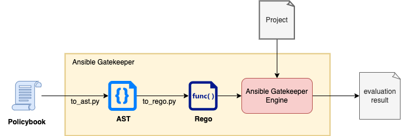
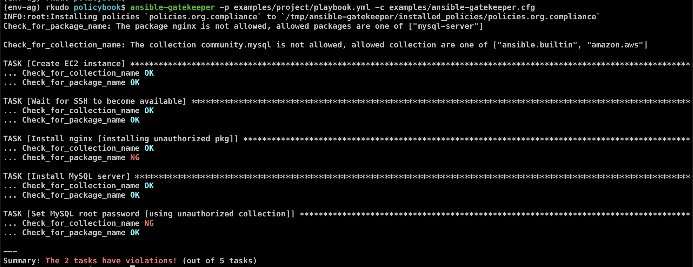

# Policybook

This doc provides step-by-step instructions on how to transpile Policybook to Rego and check it with Ansible Gatekeeper.




## Prerequisite
- install ansbile-gatekeeper command
- install requirements
```
pip install ansible-rulebook
```

## Steps
### 1. move to policybook dir
```
cd ansible_gatekeeper/policybook
```

### 2. prepare Policybook

As examples, the following policybooks can be found in the `examples/sample_policybooks` directory. 

- [policybook_check_pkg.yml](./examples/sample_policybooks/compliance/policybooks/policybook_check_pkg.yml): Check if only authorized packages are installed.
- [policybook_check_collection.yml](./examples/sample_policybooks/compliance/policybooks/policybook_check_collection.yml): Check if only authorized collections are used

```
$ ls examples/sample_policybooks/compliance/policybooks
policybook_check_collection.yml	policybook_check_pkg.yml
```

### 3. generate AST from Policybook

Policybook can be automatically transformed into AST format with the command below.
```
python to_ast.py \
-f examples/sample_policybooks/compliance/policybooks/policybook_check_pkg.yml \
-o examples/sample_policybooks/compliance/ast/ast_check_pkg.yml
```
The generated AST files are as follows:
- [ast_check_pkg.yml](./examples/sample_policybooks/compliance/ast/ast_check_pkg.yml).
- [ast_check_collection.yml](./examples/sample_policybooks/compliance/ast/ast_check_collection.yml)

### 4. generate Rego policy from AST

Rego policy can also be generated automatically from AST.
```
python to_rego.py \
-f examples/sample_policybooks/compliance/ast/ast_check_pkg.yml \
-o examples/sample_policies/compliance/policies
```
The Rego policy will be generated in the outdir.
```
$ ls examples/sample_policies/compliance/policies/
Check_for_collection_name.rego	Check_for_package_name.rego
```
And the generated Rego files are as follows:
- [Check_for_package_name.rego](./examples/sample_policies/compliance/policies/Check_for_package_name.rego).
- [Check_for_collection_name.rego](./examples/sample_policies/compliance/policies/Check_for_collection_name.rego)

### 5. evaluate a playbook by Rego policies
Let's evaluate the sample [playbook](./examples/project/playbook.yml) using the Rego policies converted from Policybooks.

The ansible-gatekeeper configuration for this example is [here](./examples/ansible-gatekeeper.cfg). Please see [this doc](../../README.md) for the details on the configuration.

```
$ ansible-gatekeeper -p examples/project/playbook.yml -c examples/ansible-gatekeeper.cfg
```


This sample [playbook](./examples/project/playbook.yml) has two violations.
From the result, you can see the details on violations.
- Check_for_package_name: The package `nginx` is not allowed, allowed packages are one of ["mysql-server"]

- Check_for_collection_name: The collection `community.mysql` is not allowed, allowed collection are one of ["ansible.builtin", "amazon.aws"]
